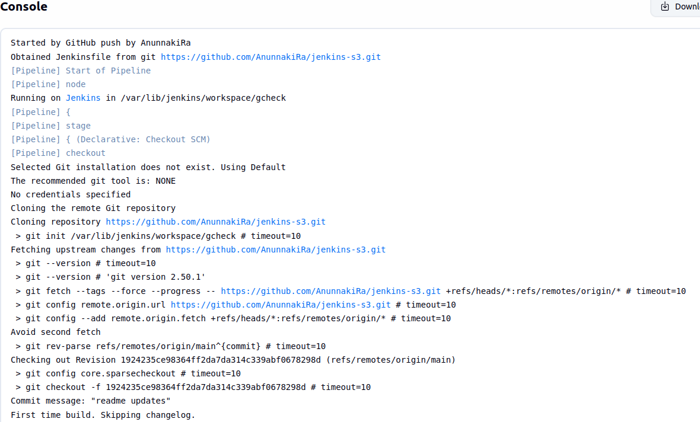
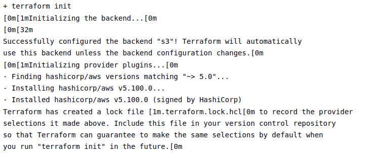
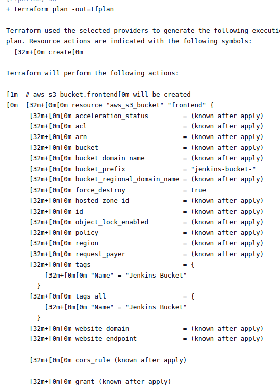
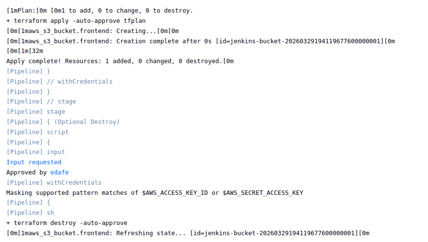
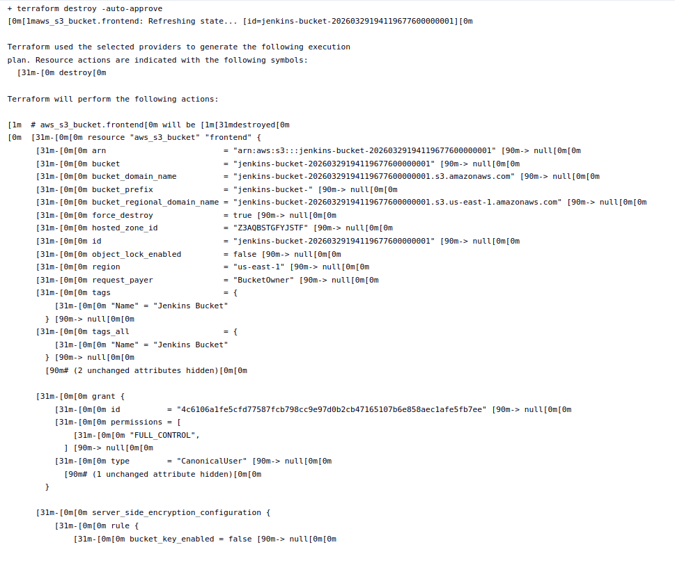

# jenkins-s3

=======
# Jenkins CI/CD Pipeline with Terraform & AWS S3

A Jenkins pipeline that automates the provisioning and teardown of AWS infrastructure using Terraform. On each run, the pipeline initializes Terraform with a remote S3 backend, plans and applies the configuration to create an S3 bucket, and then offers an optional interactive destroy step.

---

## Project Structure

```
.
├── Jenkinsfile         # Declarative Jenkins pipeline definition
├── test-bucket.tf      # Terraform configuration for the S3 bucket 
└── README.md
```

---

## Architecture Overview

```
GitHub Repo
    │
    ▼
Jenkins Pipeline
    │
    ├── Stage 1: Checkout       → Pull latest code from GitHub
    ├── Stage 2: Terraform Init → Initialize backend (S3 remote state)
    ├── Stage 3: Terraform Apply→ Plan + Apply S3 bucket creation
    └── Stage 4: Optional Destroy → Interactive prompt to tear down
                                    resources
```

---

## Prerequisites

- **Jenkins** with the following plugins installed:
  - Pipeline
  - Git
  - Amazon Web Services Credentials
- **Terraform** installed on the Jenkins agent
- **AWS credentials** stored in Jenkins as a credential with ID `edafe` (type: AWS credentials)
- An existing **S3 bucket** named `getouttamy-bucket` in `us-east-1` to store remote Terraform state

---

## Pipeline Stages

### 1. Checkout
Checks out the source code from the configured SCM (GitHub).

### 2. Terraform Init
Initializes Terraform using AWS credentials injected via Jenkins' `withCredentials` binding. Configures the S3 remote backend to store the `.tfstate` file.

```
Backend: S3
Bucket:  getouttamy-bucket
Key:     jenkins-test-032226.tfstate
Region:  us-east-1
```

### 3. Terraform Apply
Generates an execution plan (`tfplan`) and applies it automatically, creating the S3 bucket defined in `test-bucket.tf`.

**Resource created:**
| Resource | Details |
|---|---|
| Type | `aws_s3_bucket` |
| Name prefix | `jenkins-bucket-` |
| Tag | `Name = "Jenkins Bucket"` |
| Force destroy | `true` |
| Region | `us-east-1` |
| Provider | `hashicorp/aws ~> 5.0` |

### 4. Optional Destroy
An interactive input step that pauses the pipeline and asks the user whether to run `terraform destroy`. Selecting **yes** destroys all resources managed by this configuration. Selecting **no** skips the destroy and completes the pipeline successfully.

---

## Pipeline Screenshots

> Add your deliverable screenshots below.

### Pipeline Console Output – Start & Checkout


### Terraform Init – Backend & Provider Installation


### Terraform Plan – Execution Plan Output


### Terraform Apply – Resource Creation


### Optional Destroy – Resource Teardown & Pipeline Success


---

## Environment Variables

| Variable | Value | Purpose |
|---|---|---|
| `AWS_DEFAULT_REGION` | `us-east-1` | Sets the default AWS region for CLI/SDK calls |
| `TF_IN_AUTOMATION` | `true` | Suppresses interactive prompts in Terraform |

---

## Notes

- AWS credentials (`AWS_ACCESS_KEY_ID` / `AWS_SECRET_ACCESS_KEY`) are masked in all Jenkins logs.
- The S3 backend must exist before running the pipeline for the first time.
- `force_destroy = true` on the bucket allows Terraform to delete non-empty buckets during destroy.
- The `bucket_prefix` attribute lets AWS generate a unique bucket name with the given prefix, avoiding naming conflicts.